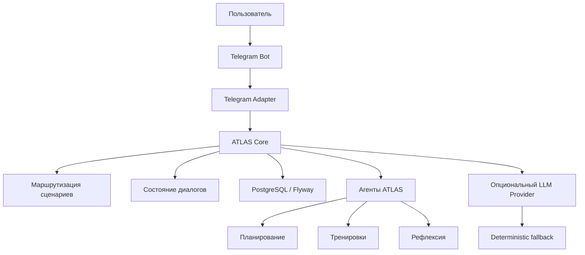

<p align="center">
  
</p>


<p align="center">
  
  
  
  
  
  
  
  
</p>

---

<h2 align="center">Описание проекта</h2>

**ATLAS** — это backend-first Telegram-продукт для управления повседневной жизнью через одного бота.

**Идея проекта** — собрать в одном Telegram-интерфейсе сценарии, которые обычно размазаны по разным приложениям: планирование, чек-ины, привычки, фокус, тренировки, восстановление, питание и недельную рефлексию.

Пользователь общается с одним ботом, а backend маршрутизирует запросы к специализированным агентам ATLAS.

ATLAS не является фронтенд-приложением, лендингом или веб-кабинетом. Основной фокус этого репозитория — backend, Telegram-интеграция, хранение данных, сценарии общения и агентная архитектура.

---

<h2 align="center">Core Scope</h2>



ATLAS Core отвечает за:

* приём и обработку Telegram-событий;
* маршрутизацию пользовательских запросов;
* управление состоянием диалогов;
* работу с сохранёнными пользовательскими данными;
* подключение специализированных агентов;
* безопасный fallback, если LLM отключён или недоступен.

---

<h2 align="center">Архитектура</h2>

ATLAS развивается как модульный монолит с явными bounded contexts, application use cases, ports-and-adapters границами, внутренними событиями и архитектурными тестами.

Проект намеренно не дробится на микросервисы раньше времени, но сохраняет понятный путь к будущему выделению Telegram gateway, life tracking, LLM agents, memory и reporting.

ATLAS is built as a modular monolith with explicit bounded contexts, application use cases, ports-and-adapters boundaries, internal events and CI-enforced architecture rules.

The project intentionally avoids premature microservices while keeping clear future extraction paths for Telegram gateway, life tracking, LLM agents, memory and reporting.

Документация:

* [Архитектура RU](docs/ru/architecture.md)
* [Architecture EN](docs/en/architecture.md)
* [ADR RU](docs/ru/adr/0001-modular-monolith.md)
* [ADR EN](docs/en/adr/0001-modular-monolith.md)

---

<h2 align="center">Агенты</h2>

В базовой модели ATLAS использует несколько специализированных агентов.

| Агент             | Зона ответственности                                                      |
| ----------------- | ------------------------------------------------------------------------- |
| **ATLAS Core**    | оркестрация, маршрутизация, состояние диалогов и связь между компонентами |
| **ATLAS Planner** | планирование дня, недели, приоритетов и следующих действий                |
| **ATLAS Coach**   | тренировки, нагрузка, дисциплина и поддержка физической активности        |

Архитектура не ограничивается только этими агентами. В дальнейшем можно добавлять собственных агентов под конкретные сценарии: питание, сон, восстановление, финансы, обучение, работу, проекты или любые другие life-ops направления.

---

<h2 align="center">Быстрый старт</h2>

Рекомендуемый локальный запуск:

```bash id="7luvh3"
git clone https://github.com/ATLAS-lifeops/ATLAS.git
cd ATLAS
make start
```

Команда `make start`:

* запускает Docker Compose;
* ждёт готовности backend;
* открывает страницу первичной настройки.

Страница настройки:

```text id="ift8yv"
http://localhost:8080/setup
```

Проверка состояния приложения:

```text id="2ruijg"
http://localhost:8080/actuator/health
```

Запуск тестов:

```bash id="gol9vh"
mvn test
```

Полезные команды для локальной разработки:

```bash id="gcdhvr"
make up
make down
make logs
make restart
make status
make clean
```

---

<h2 align="center">Локальная настройка</h2>

ATLAS поддерживает два основных локальных сценария запуска.

<h3 align="center">1. Setup Mode</h3>

Подходит для первого запуска без заранее подготовленного `.env`.

```bash id="emlu69"
make start
```

После запуска открой:

```text id="mhzb2u"
http://localhost:8080/setup
```

Дальше:

1. вставь Telegram Bot Token;
2. выбери локальный polling-режим;
3. сохрани настройки;
4. напиши `/start` боту в Telegram.

<h3 align="center">2. Preconfigured Local Bot Mode</h3>

Подходит для запуска с заранее заполненным `.env`.

```bash id="u5td8z"
cp .env.example .env
```

Добавь локально Telegram token:

```bash id="ujavcx"
ATLAS_TELEGRAM_BOT_TOKEN=<telegram-bot-token>
```

Затем запусти проект:

```bash id="wxy5p1"
make start
```

Если `ATLAS_TELEGRAM_BOT_TOKEN` задан, приложение проверит токен через Telegram `getMe`, сохранит runtime-настройки и запустит локальный polling-режим.

> Не добавляй реальные секреты в репозиторий.

---

<h2 align="center">Telegram-режимы</h2>

ATLAS поддерживает два режима работы с Telegram.

| Режим       | Назначение                                                                                       |
| ----------- | ------------------------------------------------------------------------------------------------ |
| **POLLING** | простой локальный режим, в котором приложение само читает обновления через Telegram `getUpdates` |
| **WEBHOOK** | production-режим, в котором Telegram отправляет события на публичный backend endpoint            |

Локально чаще всего используется `POLLING`.

В production рекомендуется использовать `WEBHOOK`.

---

<h2 align="center">LLM Support</h2>

По умолчанию система может работать без LLM-провайдера и использовать deterministic responses. Это позволяет запускать проект локально, тестировать Telegram UX и проверять основные сценарии без внешнего AI API.

ATLAS предусматривает подключение OpenAI-compatible provider для будущего развития LLM-powered agents.

Документация по настройке:

* [LLM setup RU](docs/ru/llm.md)
* [LLM setup EN](docs/en/llm.md)

Если LLM отключён, настроен неполно или провайдер недоступен, ATLAS должен продолжать работать через безопасные fallback-ответы.

---

<h2 align="center">Production Telegram Launch</h2>

Production-запуск рассчитан на webhook-режим.

<h3 align="center">1. Минимальные переменные окружения</h3>

```bash id="tyotdp"
ATLAS_TELEGRAM_ENABLED=true
ATLAS_TELEGRAM_BOT_TOKEN=<telegram-bot-token>
ATLAS_TELEGRAM_BOT_USERNAME=<telegram-bot-username>
ATLAS_TELEGRAM_MODE=webhook
ATLAS_TELEGRAM_WEBHOOK_PATH=/telegram/webhook
ATLAS_TELEGRAM_WEBHOOK_SECRET=<random-webhook-secret>
ATLAS_PUBLIC_BASE_URL=https://<public-domain>
ATLAS_TELEGRAM_REGISTER_WEBHOOK_ON_STARTUP=true
```

<h3 align="center">2. Health endpoint</h3>

```text id="sfln82"
GET /actuator/health
```

<h3 align="center">3. Telegram webhook endpoint</h3>

```text id="t8iewg"
POST /telegram/webhook
```

<h3 align="center">4. Production checklist</h3>

Перед production-запуском проверь:

* backend доступен по публичному HTTPS-домену;
* `ATLAS_PUBLIC_BASE_URL` указывает на production-домен;
* webhook secret задан и не хранится в репозитории;
* Telegram token не попадает в логи и публичные ответы;
* health endpoint возвращает корректный статус;
* webhook endpoint принимает Telegram updates;
* включена регистрация webhook при старте или webhook зарегистрирован вручную.

---

<h2 align="center">Roadmap</h2>

Roadmap отражает развитие проекта по ключевым релизам. Подробная история изменений находится в changelog-документации.

| Версия     | Фокус                                                                                                         | Статус                    |
| ---------- | ------------------------------------------------------------------------------------------------------------- | ------------------------- |
| **v0.2.0** | Docker, Docker Compose, PostgreSQL, базовый health check и конфигурация окружения                             | Завершено                 |
| **v0.3.0** | первая реальная Telegram-интеграция, webhook receiver и command routing                                       | Завершено                 |
| **v0.3.1** | стабилизация Telegram-интеграции, безопасная обработка обновлений и длинных ответов                           | Завершено                 |
| **v0.3.2** | очистка backend-only репозитория, удаление устаревших frontend-артефактов                                     | Завершено                 |
| **v0.3.3** | production webhook mode, webhook secret validation и production-документация                                  | Завершено                 |
| **v0.4.0** | PostgreSQL/Flyway persistence, runtime settings, setup page, polling mode и сохранение Telegram-активности    | Завершено                 |
| **v0.5.0** | onboarding, life profile, conversation states, check-ins, habits, evening reflection и weekly report          | Завершено                 |
| **v0.5.1** | button-first Telegram UX, выбор языка RU/EN, inline keyboards, main menu, settings/profile panels             | Завершено                 |
| **v0.5.2** | local launch polish: `make start`, auto-open setup, safe `.env`, preconfigured local bot mode                 | Завершено                 |
| **v0.5.3** | Telegram UX stabilization: back/menu buttons, flow continuation, settings/profile polish, docs reorganization | Завершено                 |
| **v0.5.4** | modular monolith foundation, use-case boundaries, internal events, architecture docs and rules                 | Завершено                 |
| **v0.6.0** | LLM abstraction, OpenAI-compatible provider, deterministic fallback, базовая AI-инфраструктура                | В работе / следующий этап |
| **v0.6.1** | развитие LLM-powered agents и более умная маршрутизация пользовательских сценариев                            | Запланировано             |

---

<h2 align="center">Документация</h2>

Основная документация разделена на русскую и английскую версии.

* [Русская документация](docs/ru/README.md)
* [English documentation](docs/en/README.md)

Полезные разделы:

* [Архитектура RU](docs/ru/architecture.md)
* [Architecture EN](docs/en/architecture.md)
* [Локальный запуск](docs/ru/local-launch.md)
* [Local launch](docs/en/local-launch.md)
* [Telegram UX RU](docs/ru/telegram-ux.md)
* [Telegram UX EN](docs/en/telegram-ux.md)
* [LLM setup RU](docs/ru/llm.md)
* [LLM setup EN](docs/en/llm.md)
* [История изменений RU](docs/ru/changelog.md)
* [Changelog EN](docs/en/changelog.md)

---

<p align="center">
  
</p>

---
