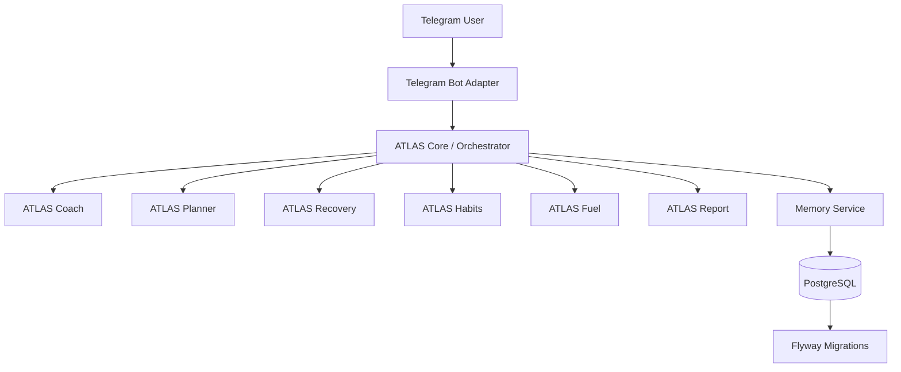

<p align="center">
  
</p>

<h1 align="center">ATLAS</h1>

**ATLAS** — персональная AI-система для управления режимом, спортом, восстановлением, привычками, питанием и прогрессом.

Проект задуман как мультиагентный Telegram-бот: пользователь общается с одним ботом, а внутри системы запросы обрабатывает команда специализированных AI-агентов.

<h2 align="center">Идея</h2>

ATLAS помогает держать жизнь в ритме:

- планировать день и неделю;
- подбирать тренировки под состояние и цель;
- учитывать сон, усталость и восстановление;
- отслеживать привычки;
- помогать с питанием;
- собирать недельную аналитику;
- возвращать пользователя в режим после срывов или перегруза.

Главный принцип проекта: **реалистичный план лучше идеального плана, который не будет выполнен**.

<h2 align="center">Агенты</h2>

В первой версии ATLAS включает 7 логических агентов:

| Агент | Зона ответственности |
|---|---|
| **ATLAS Core** | Главный координатор, маршрутизация запросов |
| **ATLAS Coach** | Спорт, тренировки, нагрузка |
| **ATLAS Planner** | Расписание дня и недели |
| **ATLAS Recovery** | Сон, усталость, восстановление |
| **ATLAS Habits** | Привычки, дисциплина, ритм |
| **ATLAS Fuel** | Питание под цель |
| **ATLAS Report** | Недельная аналитика и прогресс |

<h2 align="center">Основные команды</h2>

```text
/start      — запуск и первичная настройка
/day        — план на день
/week       — план на неделю
/workout    — тренировка на сегодня
/checkin    — чек-ин состояния
/recovery   — оценка восстановления
/habits     — работа с привычками
/food       — питание на день
/report     — недельный отчёт
/emergency  — минимальный план, если день развалился
```

<h2 align="center">Архитектура</h2>

Пользователь взаимодействует с одним Telegram-ботом.  
Все агенты существуют внутри backend-приложения как отдельные сервисы или модули.



<h2 align="center">Стек</h2>

Базовый стек проекта:

- **Java 21**
- **Spring Boot**
- **Maven**
- **PostgreSQL**
- **Flyway**
- **JUnit 5**
- **Telegram Bot API**
- **LLM Provider Abstraction**

На старте проект не привязан к конкретному LLM-провайдеру.  
Интеграция с AI должна быть реализована через интерфейс, чтобы в будущем можно было подключить OpenAI, Spring AI, LangChain4j или другой провайдер.

## Local Startup

ATLAS можно запустить двумя способами:

- native Maven run для разработки Java-приложения;
- Docker Compose run для локальной инфраструктуры с PostgreSQL.

Native run требует доступный PostgreSQL и переменные окружения для datasource:

```bash
mvn spring-boot:run
```

Telegram-интеграция по умолчанию выключена через `ATLAS_TELEGRAM_ENABLED=false`, поэтому локальный инфраструктурный запуск не требует реального Telegram token.

## Docker

Requirements:

- Docker
- Docker Compose
- Java 21 и Maven для локальных тестов без контейнеров

Подготовить локальные переменные окружения:

```bash
cp .env.example .env
```

Запустить PostgreSQL и приложение:

```bash
docker compose up --build
```

Остановить сервисы:

```bash
docker compose down
```

Смотреть логи приложения:

```bash
docker compose logs -f atlas-app
```

Пересобрать приложение:

```bash
docker compose up --build atlas-app
```

Удалить контейнеры и локальный PostgreSQL volume:

```bash
docker compose down -v
```

Запустить тесты локально:

```bash
mvn test
```

Health endpoint доступен по адресу:

```text
http://localhost:8080/actuator/health
```

<h2 align="center">Статус проекта</h2>

Проект находится на ранней стадии разработки.

Текущий фокус версии `v0.2.0`:

```text
1. Локальная Docker-инфраструктура
2. Docker Compose для приложения и PostgreSQL
3. Environment-based configuration
4. Telegram integration toggle
5. Actuator health endpoint
6. README с Docker workflow
7. Базовый CI workflow
```

<h2 align="center">Принцип маршрутизации</h2>

ATLAS Core определяет тип запроса и выбирает нужных агентов.

Примеры:

| Команда | RequestType | Агент |
|---|---|---|
| `/start` | `START` | `ATLAS Core` |
| `/day` | `DAY_PLAN` | `ATLAS Planner` |
| `/week` | `WEEK_PLAN` | `ATLAS Planner` |
| `/workout` | `WORKOUT` | `ATLAS Coach` |
| `/checkin` | `CHECKIN` | `ATLAS Coach`, `ATLAS Recovery` |
| `/recovery` | `RECOVERY` | `ATLAS Recovery` |
| `/habits` | `HABITS` | `ATLAS Habits` |
| `/food` | `FOOD` | `ATLAS Fuel` |
| `/report` | `REPORT` | `ATLAS Report` |
| `/emergency` | `EMERGENCY` | `ATLAS Habits`, `ATLAS Recovery` |

Если запрос не подходит ни под одну команду, он обрабатывается как `GENERAL`.

<h2 align="center">Важное уточнение</h2>

ATLAS не является врачом, диетологом или медицинским специалистом.

Система не должна:

- ставить диагнозы;
- назначать лечение;
- рекомендовать тренироваться через боль;
- предлагать экстремальные диеты;
- поощрять опасное снижение веса;
- игнорировать травмы, боль, проблемы с дыханием, сердцем или давлением.

При серьёзных симптомах бот должен рекомендовать обратиться к врачу или профильному специалисту.

<h2 align="center">Roadmap</h2>

```text
v0.1.0 — skeleton, agents, orchestrator, migrations, README
v0.2.0 — local Docker infrastructure, env config, healthcheck, CI
v0.3.0 — real Telegram bot adapter
v0.4.0 — persistence for messages, profiles, check-ins
v0.5.0 — LLM client abstraction + mock/provider implementation
v0.6.0 — real daily planning and workout flow
```

<h2 align="center">Цель</h2>

Сделать персональную AI-систему, которая помогает пользователю не просто получать советы, а каждый день принимать более реалистичные решения по режиму, спорту, восстановлению и дисциплине.

ATLAS должен быть не очередным чат-ботом, а спокойной системой координации:

```text
Меньше хаоса. Больше ритма.
```

<h2 align="center">License</h2>

License will be defined later.
